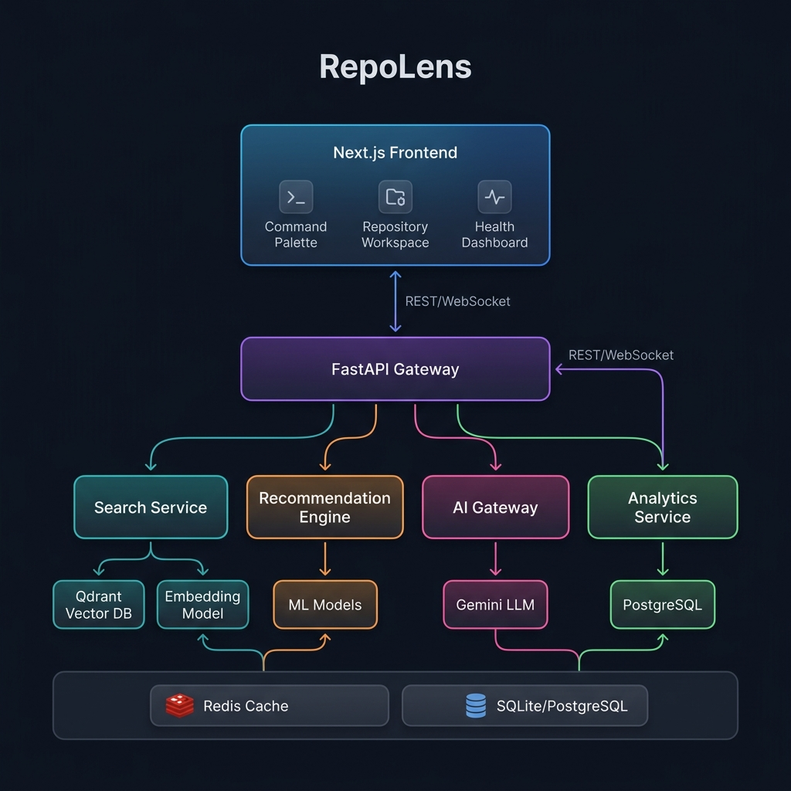
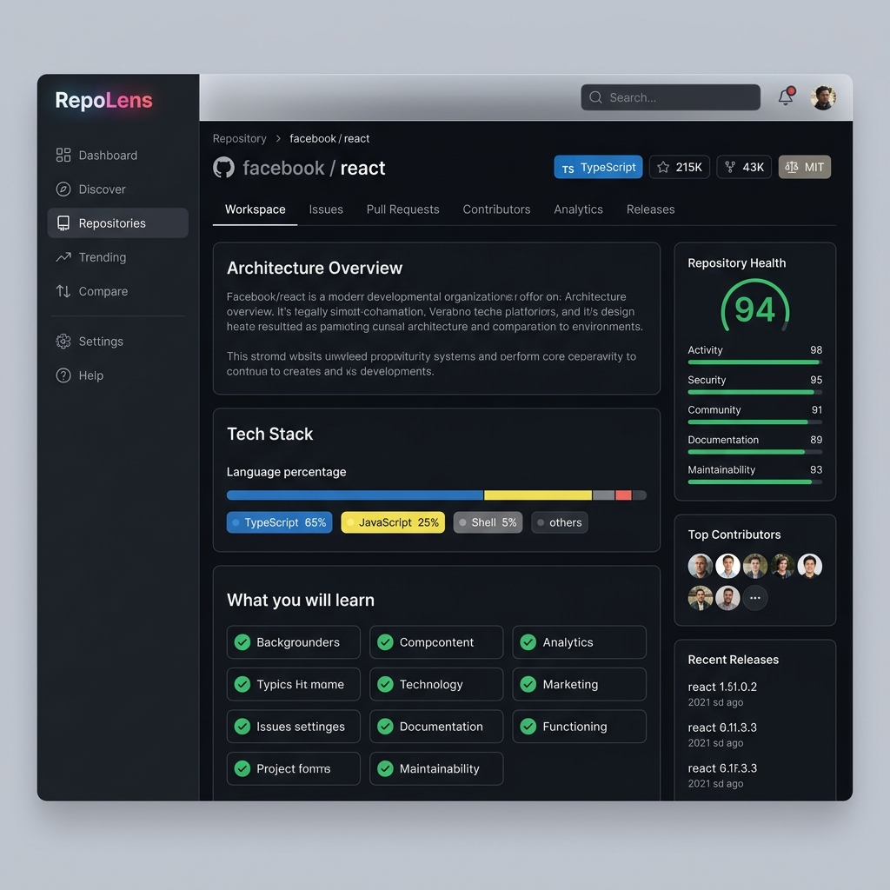
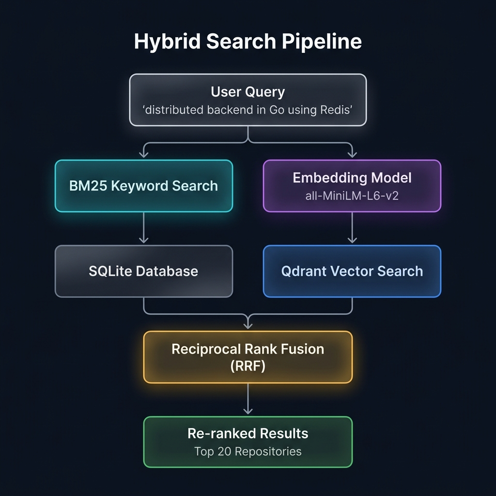
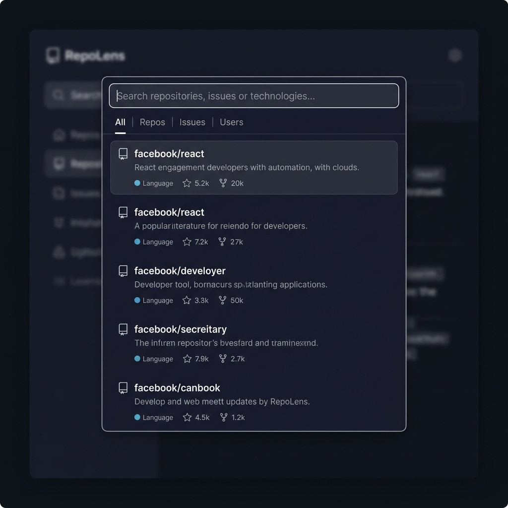

<p align="center">
  
</p>

<h1 align="center">RepoLens</h1>

<p align="center">
  <strong>AI-Powered Open Source Discovery & Contribution Intelligence Platform</strong>
</p>

<p align="center">
  
  
  
  
  
  
  
</p>

---

## What is RepoLens?

RepoLens is a full-stack platform that helps developers **discover, evaluate, and contribute** to open source projects — powered by machine learning, a hybrid search engine, and LLM-based code intelligence.

Instead of relying on basic keyword searches and inconsistent "good first issue" labels, RepoLens provides:

- **Semantic search** that understands natural language queries like *"distributed backend in Go using Redis"*
- **Repository health scoring** across 5 dimensions — so you know if a project is actively maintained before investing time
- **AI-powered contribution guidance** — step-by-step instructions tailored to your skill level
- **Personalized recommendations** — repositories and issues matched to your programming skills

<p align="center">
  
</p>

---

## Key Features

### 🔍 Hybrid Search Engine

The search pipeline combines **keyword matching** (BM25 via SQLite) with **vector similarity** (Qdrant + Sentence Transformers), then fuses results using **Reciprocal Rank Fusion (RRF)**. This means a query like *"real-time data pipeline"* surfaces semantically relevant repositories even if they don't contain those exact words.

<p align="center">
  
</p>

**How it works:**
1. User query is encoded into a 384-dimensional vector using `all-MiniLM-L6-v2`
2. BM25 keyword search runs against SQLite in parallel with Qdrant vector search
3. Both result sets are merged using RRF scoring: `score(d) = Σ 1/(k + rank)`
4. Top results are returned, ranked by combined relevance

### 🏥 Repository Health Engine

Every repository is scored across **5 dimensions** based on real-time GitHub data:

| Dimension | What It Measures |
|---|---|
| **Activity** | Push recency, PR velocity, commit frequency |
| **Community** | Contributors, stars, forks, code of conduct |
| **Documentation** | README quality, wiki presence, doc depth |
| **Security** | License, security policy, dependency health |
| **Maintainability** | Issue close rate, release cadence |

Each dimension includes **trend indicators** (improving/stable/declining) and **actionable recommendations** like *"Add a SECURITY.md file"* or *"Issue close rate is below 50%"*.

### 🎯 Recommendation Engine

Given a developer's skill set (e.g., `["Python", "FastAPI", "machine-learning"]`), the engine:

1. Encodes skills into a vector and searches Qdrant for semantically similar repositories
2. Applies **skill-affinity boosting** using a curated mapping (e.g., Python → Django, Flask, PyTorch)
3. Scores open issues by matching labels against difficulty weights
4. Returns ranked recommendations with explanations like *"Strong match — uses Python, tagged with machine-learning"*

### 🤖 AI Gateway (LLM Integration)

A centralized gateway routes all AI calls through a single service, providing:

- **Repository explanations** — beginner-friendly summaries of what a project does
- **Contribution coaching** — step-by-step PR guides tailored to your skills
- **Multi-repo comparison** — AI-generated strengths/weaknesses analysis
- **Repository chat** — ask questions about a codebase with context from the README

All responses are cached to avoid redundant LLM calls. The model is swappable — currently Gemini, but the gateway abstracts the provider.

### ⌨️ Command Palette Search

A Spotlight-style command palette (`Ctrl+K`) with **400ms debouncing**, **live GitHub results**, and recent search history.

<p align="center">
  
</p>

### 📊 Repository Workspace

A complete workspace for evaluating any GitHub repository:

- **Header** with stars, forks, license, last push date
- **Tech Stack** with language percentage bar and colored badges
- **Health Dashboard** with 5-dimension scoring and recommendations
- **Open Issues** table with difficulty labels and estimated time
- **Activity Timeline** showing recent commits
- **AI Summary** with architecture overview and learning outcomes
- **Top Contributors** with avatars
- **Recent Releases** with version tags

### 📈 Trending & Compare

- **Trending page** — repositories ranked by star count from local data
- **Compare page** — side-by-side stats table + AI-generated comparison for 2-5 repositories

---

## Architecture

<p align="center">
  
</p>

The system follows a **microservice-ready monolith** pattern — logically separated services that can be extracted into independent services as scale demands.

**Data flow:**

```
User types query → 400ms debounce → Cache check → GitHub GraphQL API
→ Parse + validate (Pydantic v2) → Upsert to SQLite → Generate embeddings
→ Store in Qdrant → Write to cache (5 min TTL) → Return to frontend
```

**Key design decisions:**

| Decision | Reasoning |
|---|---|
| **GraphQL over REST** for GitHub | Single query fetches 12+ fields in one round trip |
| **Cache-first reads** | Repeat searches return in <50ms; protects against rate limits |
| **Upsert-on-write** | Local DB grows into a knowledge base over time |
| **Async I/O everywhere** | httpx + FastAPI async = no thread contention |
| **DTO pattern** | Frontend never receives raw third-party API data |
| **LLM Gateway** | Swap models, manage prompts, cache responses — all in one place |

---

## Tech Stack

### Frontend

| Technology | Role |
|---|---|
| **Next.js 15** | App Router, React Server Components |
| **TypeScript** | End-to-end type safety |
| **Tailwind CSS** | Utility-first styling |
| **shadcn/ui** | Accessible, composable component library |
| **cmdk** | Command palette with keyboard navigation |
| **TanStack Query** | Server state management |
| **Zustand** | Lightweight client state |
| **Framer Motion** | Animations and transitions |
| **Recharts** | Data visualization |

### Backend

| Technology | Role |
|---|---|
| **FastAPI** | Async Python framework with auto-generated OpenAPI docs |
| **SQLAlchemy 2** | ORM with SQLite (dev) / PostgreSQL (prod) |
| **httpx** | Async HTTP client for GitHub GraphQL |
| **Pydantic v2** | Request/response validation and DTOs |
| **Celery + Redis** | Background jobs for embeddings and health scoring |

### AI / ML

| Technology | Role |
|---|---|
| **Qdrant** | Vector database for semantic search (384-dim vectors) |
| **Sentence Transformers** | Text embedding with `all-MiniLM-L6-v2` |
| **Google Gemini** | LLM for summaries, coaching, and chat |
| **Reciprocal Rank Fusion** | Hybrid search result merging algorithm |

### Infrastructure

| Technology | Role |
|---|---|
| **Docker Compose** | Local orchestration (PostgreSQL + Redis) |
| **Vercel** | Frontend deployment |
| **GitHub Actions** | CI/CD pipeline |

---

## Project Structure

```
RepoLens/
│
├── frontend/
│   └── src/
│       ├── app/                         # Next.js App Router
│       │   ├── (dashboard)/             # Main workspace + trending + compare
│       │   ├── (auth)/                  # Login / OAuth
│       │   └── (layout)/               # Shared layout shell
│       ├── components/
│       │   ├── layout/                  # AppShell, Navbar, Sidebar
│       │   ├── ui/                      # shadcn components (20+)
│       │   └── common/                  # Providers (theme, query)
│       ├── features/
│       │   ├── repository/              # Full repository workspace
│       │   │   └── components/          # Header, Health, Tabs, Issues, Activity...
│       │   └── search/                  # Command palette
│       │       ├── components/          # GlobalSearch, SearchResultRow, Tabs
│       │       └── hooks/               # useRecentSearches
│       └── services/                    # API client (api.ts)
│
└── backend/
    └── app/
        ├── core/
        │   ├── config.py                # pydantic-settings, env loading
        │   ├── cache.py                 # TTL cache (Redis-compatible)
        │   └── vector/client.py         # Qdrant client singleton
        ├── db/session.py                # SQLAlchemy engine + session
        ├── github/client.py             # Async GraphQL client (530 lines)
        ├── models/repository.py         # SQLAlchemy ORM model
        ├── search/
        │   ├── router.py                # GET /search + POST /search/semantic
        │   ├── service.py               # Cache-first logic + embedding indexing
        │   ├── hybrid.py                # Reciprocal Rank Fusion (RRF)
        │   └── schemas.py               # Pydantic DTOs
        ├── repository/
        │   ├── router.py                # GET /{owner}/{name}, /health, /similar
        │   ├── health.py                # Health scoring engine (5 dimensions)
        │   └── schemas.py               # RepositoryDetailDTO, IssueDTO, etc.
        ├── recommendations/
        │   ├── router.py                # POST /repositories, POST /issues
        │   └── engine.py                # Skill matching + issue scoring
        ├── ai/
        │   └── router.py               # Contribution coach, explain, compare, chat
        ├── analytics/
        │   └── router.py               # Trending, language trends, topic trends
        ├── ml/
        │   ├── llm.py                   # LLM Gateway (Gemini, cached, swappable)
        │   └── embeddings.py            # SentenceTransformer service
        └── main.py                      # FastAPI entrypoint, CORS, lifespan
```

---

## API Endpoints

### Implemented

| Method | Endpoint | Description |
|---|---|---|
| `GET` | `/api/v1/search?q=react` | Keyword search with cache-first strategy |
| `POST` | `/api/v1/search/semantic` | Hybrid search (BM25 + vector + RRF) |
| `GET` | `/api/v1/repositories/{owner}/{name}` | Full repository details |
| `GET` | `/api/v1/repositories/{owner}/{name}/health` | Detailed health score breakdown |
| `GET` | `/api/v1/repositories/{owner}/{name}/issues` | Open issues with difficulty labels |
| `GET` | `/api/v1/repositories/{owner}/{name}/activity` | Recent commit history |
| `GET` | `/api/v1/repositories/{owner}/{name}/summary` | AI-generated repository summary |
| `GET` | `/api/v1/repositories/{owner}/{name}/similar` | Similar repos via vector similarity |
| `GET` | `/api/v1/analytics/trending` | Trending repositories by stars |
| `GET` | `/api/v1/analytics/languages` | Language distribution analytics |
| `GET` | `/api/v1/analytics/topics` | Topic/technology trend analytics |
| `POST` | `/api/v1/recommendations/repositories` | Skill-based repo recommendations |
| `POST` | `/api/v1/recommendations/issues` | Issue recommendations by difficulty |
| `POST` | `/api/v1/ai/explain` | AI-powered repository explanation |
| `POST` | `/api/v1/ai/contribution-coach` | Step-by-step contribution guidance |
| `POST` | `/api/v1/ai/repositories/compare` | Multi-repo AI comparison |
| `POST` | `/api/v1/ai/repositories/{owner}/{name}/chat` | Context-aware repository Q&A |

### Example Response — Search

```json
{
  "query": "react",
  "count": 20,
  "cached": false,
  "results": [
    {
      "id": 1,
      "full_name": "facebook/react",
      "description": "The library for web and native user interfaces.",
      "language": "JavaScript",
      "stars": 232000,
      "forks": 47400,
      "topics": ["javascript", "frontend", "react"]
    }
  ]
}
```

### Example Response — Health

```json
{
  "overall": { "score": 94, "label": "Excellent", "trend": "trending_up" },
  "dimensions": {
    "activity": { "score": 98, "label": "Excellent", "trend": "trending_up",
      "factors": { "push_recency": "0 days ago", "merged_prs": 12500 }
    },
    "security": { "score": 95, "label": "Excellent",
      "factors": { "has_license": true, "has_security_policy": true }
    }
  },
  "recommendations": ["All health indicators are strong"]
}
```

---

## Skills Demonstrated

This project demonstrates proficiency across the full stack:

| Area | Skills |
|---|---|
| **Backend Engineering** | Python, FastAPI, async I/O, REST API design, GraphQL integration |
| **Frontend Engineering** | React 19, Next.js 15, TypeScript, component architecture, state management |
| **Machine Learning** | Vector embeddings, semantic search, hybrid ranking, recommendation systems |
| **System Design** | Cache-first architecture, DTO patterns, microservice-ready design |
| **Database** | SQLAlchemy ORM, upsert patterns, SQLite → PostgreSQL migration path |
| **AI/LLM Integration** | Prompt engineering, response caching, gateway pattern, model abstraction |
| **DevOps** | Docker Compose, environment configuration, CI/CD readiness |
| **Data Engineering** | ETL from GitHub API, feature engineering for health scores |

---

## Getting Started

### Prerequisites

- Node.js 18+
- Python 3.11+
- GitHub Personal Access Token ([create one here](https://github.com/settings/tokens) — `public_repo` scope)

### Backend

```bash
cd backend
python -m venv .venv
source .venv/bin/activate

pip install -r requirements.txt

# Configure environment
echo "GITHUB_TOKEN=ghp_your_token" > .env
echo "DATABASE_URL=sqlite:///./repolens.db" >> .env

# Start the API server
uvicorn app.main:app --reload --port 8000
```

API docs available at: **http://localhost:8000/docs**

### Frontend

```bash
cd frontend
npm install
npm run dev
```

App available at: **http://localhost:3002**

### Docker (PostgreSQL + Redis)

```bash
cd backend/docker
docker-compose up -d
```

---

## Future Roadmap

- [ ] OAuth login with GitHub for personalized profiles
- [ ] Celery workers for background embedding generation
- [ ] Redis cache replacement for in-memory cache
- [ ] PostgreSQL migration for production data
- [ ] Cross-encoder re-ranking in the search pipeline
- [ ] Kubernetes deployment manifests
- [ ] Prometheus + Grafana monitoring

---

## Author

**Aayushi Dhurandhar**

GitHub: [github.com/Aayushiii25](https://github.com/Aayushiii25)
